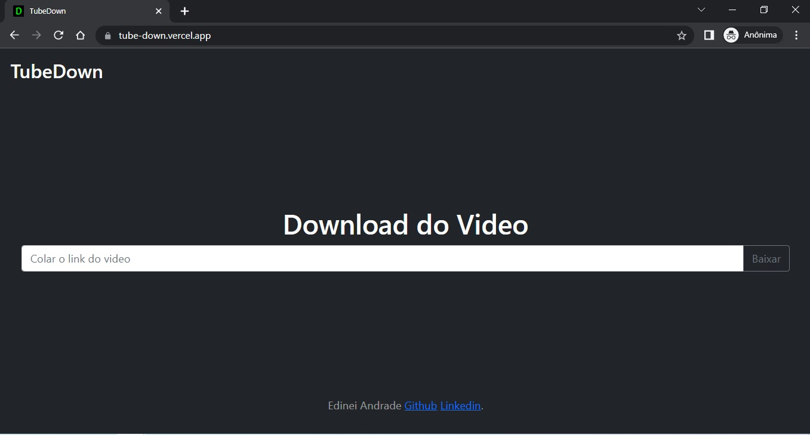

# TobeDown

APP para baixar videos do Youtube

#

## Tecnologias utilizadas

## Front End

- HTML
- CSS
- JS

### Back End

- Node

### Hospedagem

- Front End Vercel e Back End Heroku

#

Link [TubeDown](https://tube-down.vercel.app/)

#

## Layout



# Biblioteca Utilizada

## Link: https://www.npmjs.com/package/ytdl-core

## node-ytdl-core


[](https://codecov.io/gh/fent/node-ytdl-core)
[](https://discord.gg/V3vSCs7)

Mais um módulo de download do YouTube. Escrito apenas com Javascript e uma interface de streaming amigável ao nó.

## Apoio, suporte

Link do Discord [chat server](https://discord.gg/V3vSCs7)

## Instalação

Usando o Npm:

```bash
npm install ytdl-core@latest
```

Usando o Yarn:

```bash
yarn add ytdl-core@latest
```

## Uso

```js
const fs = require("fs");
const ytdl = require("ytdl-core");
// TypeScript: importa ytdl de 'ytdl-core'; with --esModuleInterop
// TypeScript: import * as ytdl de 'ytdl-core'; com --allowSyntheticDefaultImports
// TypeScript: import ytdl = require('ytdl-core'); com nenhuma das opções acima

ytdl("http://www.youtube.com/watch?v=aqz-KE-bpKQ").pipe(
  fs.createWriteStream("video.mp4")
);
```
